# THT Payment Collections Portal

Payment collection portal where external systems redirect users to pay USD amounts, collected in COP through Supra API.

## Tech Stack

- **Backend:** NestJS + TypeScript
- **Frontend:** React + Vite + TypeScript
- **Package Manager:** pnpm

## Quick Start

### Prerequisites

- Node.js 18+
- pnpm (`npm install -g pnpm`)

### Backend

```bash
cd backend
pnpm install
cp .env.example .env  # Configure your credentials
pnpm run start:dev
```

Server runs on `http://localhost:3000`

### Frontend

```bash
cd frontend
pnpm install
cp .env.example .env
pnpm run dev
```

App runs on `http://localhost:5173`

## Environment Variables

### Backend (.env)

```
PORT=3000
SUPRA_API_URL=<supra_api_endpoint>
SUPRA_CLIENT_ID=<your_client_id>
SUPRA_SECRET=<your_secret>
```

### Frontend (.env)

```
VITE_API_URL=http://localhost:3000
```

## API Endpoints

| Method | Endpoint                  | Description          |
| ------ | ------------------------- | -------------------- |
| GET    | `/health`                 | Health check         |
| POST   | `/api/payment/quote`      | Get USD→COP quote    |
| POST   | `/api/payment/process`    | Create payment       |
| GET    | `/api/payment/status/:id` | Get payment status   |
| GET    | `/api/payment/balances`   | Get account balances |

## Testing

```bash
cd backend
make test-e2e
```

## User Flow

Entry point: `http://localhost:5173/quote?amount=349`

```mermaid
sequenceDiagram
    participant HP as HomePage<br/>(Store Frontend)
    participant QP as QuotePage<br/>(Frontend)
    participant CP as ConfirmationPage<br/>(Frontend)
    participant BE as Backend<br/>(NestJS)
    participant DB as Database<br/>(Postgres)
    participant SA as Supra API
    participant SEP as Supra External<br/>Payment Page

    Note over HP,SEP: FASE 0: ORDER INTENTION & BALANCE CHECK (NUEVO)

    HP->>HP: Select Product & User
    HP->>BE: POST /orders<br/>{userId, productId, qty}
    activate BE

    BE->>DB: Find User & Product
    BE->>DB: SAVE Order (Status: DRAFT/PENDING)
    activate DB
    DB-->>BE: Order Entity (ID: 123)
    deactivate DB

    BE->>SA: GET /v1/payout/user/balances<br/>(Check Funds)
    activate SA
    SA-->>BE: {available: 50000} (COP)
    deactivate SA

    alt 💰 Sufficient Balance (RICH USER)
        BE->>DB: UPDATE Order (Status: COMPLETED,<br/>Snapshot Prices)
        activate DB
        DB-->>BE: Updated Order
        deactivate DB
        BE-->>HP: {status: COMPLETED, order: {...}}
        HP->>HP: Show Success Message (Skip Payment)

    else 💸 Insufficient Balance (POOR USER)
        BE-->>HP: {status: PENDING, requiresPayment: true,<br/>shortfall: 34900, redirectUrl: /quote?orderId=123}
        deactivate BE

        HP->>QP: Redirect with ?orderId=123

        Note over HP,SEP: FASE 1: QUOTE (Cotización USD → COP) (EXISTENTE)

        activate QP
        QP->>BE: POST /api/payment/quote<br/>{amount: 34900, orderId: 123}
        activate BE

        BE->>SA: POST /v1/auth/token
        activate SA
        SA-->>BE: {token}
        deactivate SA

        BE->>SA: POST /v1/exchange/quote<br/>{initialCurrency: USD, finalCurrency: COP,<br/>initialAmount: 34900}
        activate SA
        SA-->>BE: {quoteId, exchangeRate,<br/>finalAmount, expiresAt}
        deactivate SA

        BE-->>QP: {quoteId, finalAmount, exchangeRate...}
        deactivate BE

        QP->>QP: Display quote + 45s timer
        QP->>QP: User fills form (UserData)

        Note over HP,SEP: FASE 2: PAYMENT CREATION (EXISTENTE)

        QP->>QP: User clicks "Proceed to Payment"

        QP->>BE: POST /api/payment/process<br/>{quoteId, userData, orderId: 123}
        activate BE

        BE->>SA: POST /v1/auth/token
        activate SA
        SA-->>BE: {token}
        deactivate SA

        BE->>SA: GET /v1/exchange/quote/:id<br/>(validate quote)
        activate SA
        SA-->>BE: {quote details}
        deactivate SA

        BE->>SA: POST /v1/auth/token
        activate SA
        SA-->>BE: {token}
        deactivate SA

        BE->>SA: POST /v1/payin/payment<br/>{currency: COP, amount, quoteId...}
        activate SA
        SA-->>BE: {paymentId, paymentLink, status: CREATED}
        deactivate SA

        BE-->>QP: {paymentId, paymentLink, status}
        deactivate BE

        QP->>QP: localStorage.setItem('pendingPaymentId', paymentId)
        QP->>QP: localStorage.setItem('pendingOrderId', 123)
        QP->>SEP: window.location.href = paymentLink
        deactivate QP

        Note over HP,SEP: FASE 3: EXTERNAL PAYMENT (EXISTENTE)

        activate SEP
        SEP->>SEP: User completes payment
        SEP->>CP: Redirect to localhost:5173/confirmation
        deactivate SEP

        Note over HP,SEP: FASE 4: CONFIRMATION & ORDER UPDATE (MEJORADO)

        activate CP
        CP->>CP: Retrieve paymentId & orderId

        CP->>BE: GET /api/payment/status/:paymentId
        activate BE
        BE->>SA: Check Payment Status...
        activate SA
        SA-->>BE: {status: PAID, amount...}
        deactivate SA

        opt IF STATUS === PAID
             BE->>DB: UPDATE Order (ID: 123)<br/>Set Status: COMPLETED<br/>Save Snapshot (Rate/Total)
             activate DB
             DB-->>BE: Success
             deactivate DB
        end

        BE-->>CP: {paymentStatus: PAID, orderStatus: COMPLETED}
        deactivate BE

        CP->>BE: GET /api/payment/balances (Refresh UI)
        activate BE
        BE->>SA: Get Balances...
        SA-->>BE: Balances
        BE-->>CP: {usd, cop}
        deactivate BE

        CP->>CP: Show Final Success
        deactivate CP
    end
```



## Key Technical Decisions

1. **Factor 100:** All amounts multiplied by 100 for Supra API
2. **localStorage:** Used to persist paymentId across Supra redirect
3. **Token per operation:** Fresh token for each Supra API call
4. **Canonical logging:** One log per operation at the end
5. **Integration tests:** Focus on user flows, not unit tests
